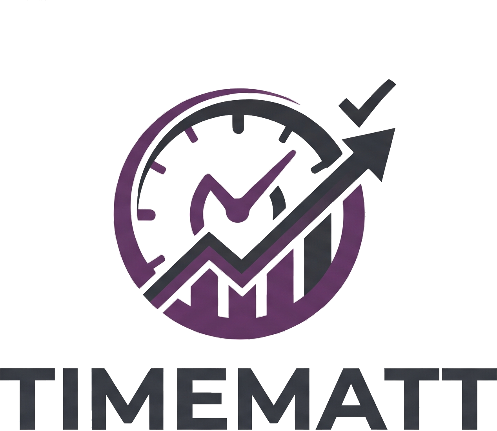

<p align="center">
  
</p>

<h1 align="center">TimeMatt</h1>

<p align="center">
  A self-hosted dashboard for freelancers to manage clients, projects, tasks, time tracking and invoicing-ready reports.
</p>

---

## What this project sets out to be

TimeMatt is a lightweight workspace for a solo freelancer (or a very small studio) to run their client work from one place:

- Keep a CRM-style list of **clients** and the projects tied to each one.
- Track **projects** through their lifecycle (Draft → Active → Review → Completed/Archived), fixed-price or hourly.
- Break work into **tasks** on a Kanban board, a list, or a grid — with a dedicated detail page per task.
- **Track time** against a specific project and task, with a running timer and daily/weekly/monthly summaries.
- Generate **reports** (charts + exportable PDF/CSV) summarizing hours, revenue and project health.
- Manage who has **access to the workspace** — the owner, team members, and invited clients — through real authentication, not a mock login.

It's built as a real, running application rather than a static mockup: it persists to an actual database, sends real email for account invites and password resets, and hashes every password.

## Core features

- **Dashboard** — active projects, revenue, pending tasks, hours trends, upcoming deadlines, recent activity.
- **Clients** — list/detail views, per-client revenue and hours, and a "New Client" flow that emails an invite.
- **Projects** — list/detail with tabs for overview, tasks, files, and comments; fixed vs. hourly billing.
- **Tasks** — Kanban (drag & drop), list, and grid views, plus a task detail page with time tracking built in.
- **Time Tracking** — start/pause/stop timer tied to a project and task, with historical session breakdowns.
- **Reports** — hours/revenue charts, and one-click PDF (print-ready) and CSV export of the whole workspace.
- **Accounts** — a directory of everyone with workspace access, grouped by role.
- **Authentication** — cookie-based sign-in via ASP.NET Core Identity, forgot/reset password, in-app change password, and a client invite flow (temporary password + 48h reset link, delivered by email).

## Technologies

| Layer | Technology |
|---|---|
| Framework | ASP.NET Core MVC (.NET 10) |
| Views | Razor views, Bootstrap 5, Bootstrap Icons |
| Client-side | Vanilla JavaScript, Chart.js (charts), SortableJS (Kanban drag & drop) |
| Auth | ASP.NET Core Identity (cookie authentication, password hashing, roles) |
| Data access | Entity Framework Core 9 (Identity + domain persistence) |
| Database | MySQL / MariaDB via Pomelo.EntityFrameworkCore.MySql |
| Email | SMTP (`System.Net.Mail`), sent to a local [Mailpit](https://github.com/axllent/mailpit) inbox in development |
| Reporting | Server-generated CSV export; print-optimized HTML for PDF (via the browser's "Print to PDF") |

## Architecture & SOLID principles

The codebase leans on SOLID to keep the mock-data-turned-real-app manageable as it grew:

- **Single Responsibility** — controllers stay thin and only orchestrate HTTP concerns; business/report logic lives in dedicated services (e.g. `ReportService` builds the exportable report model and CSV independently of `DashboardController`, which only wires HTTP to it).
- **Open/Closed** — cross-cutting presentation rules (status/priority badge colors and labels, hour/currency formatting) are implemented as extension methods (`BadgeHelpers`), so new statuses or formats can be added without touching every view that uses them.
- **Liskov Substitution** — every service has a matching interface (`ClientService` ⇄ `IClientService`, `ProjectService` ⇄ `IProjectService`, etc.) and is registered and consumed strictly through that interface, so any conforming implementation can be swapped in without breaking callers.
- **Interface Segregation** — instead of one large service contract, each interface exposes only the members its own consumers need (`IReportService`, `ITaskService`, `ITimeTrackingService`, `IEmailSender`, …), so implementers and mocks aren't forced to satisfy unrelated methods.
- **Dependency Inversion** — controllers and services depend on abstractions (`IClientService`, `IProjectService`, `IDashboardService`, `IEmailSender`, …) resolved through ASP.NET Core's built-in DI container in `Program.cs`, never on concrete classes directly.

## Project structure

```
TimeMatt/
├── Controllers/     # Thin MVC controllers (HTTP orchestration only)
├── Services/        # Business logic, one interface + implementation per concern
│   └── Interfaces/  # ISomeService contracts consumed via DI
├── Models/          # Domain entities (Client, Project, ProjectTask, TimeEntry, ...)
├── ViewModels/       # View-binding models (one per page/feature, never domain data)
├── Identity/        # ApplicationUser (extends IdentityUser)
├── Data/            # AppDbContext (IdentityDbContext) + Identity seeding
├── Options/         # Strongly-typed configuration (SMTP, predefined user, ...)
├── Migrations/       # EF Core migrations
├── Views/           # Razor views, organized by controller
└── wwwroot/         # Static assets (css, js, logo)
```

## Getting started

### Prerequisites

- [.NET 10 SDK](https://dotnet.microsoft.com/download)
- A running MySQL server
- [Mailpit](https://github.com/axllent/mailpit) for catching invite/reset emails in development

### Setup

1. Update `appsettings.json` with your database connection string and SMTP host, if different from the defaults.
2. Apply the database migrations:
   ```bash
   dotnet ef database update
   ```
3. Run the app:
   ```bash
   dotnet run
   ```
4. Sign in with the seeded owner account:
   - **Email:** `alex.morgan@textmatt.dev`
   - **Password:** `Freelance123!`

New clients you invite from the **Clients** page will receive a temporary password and a 48-hour password-setup link by email.
